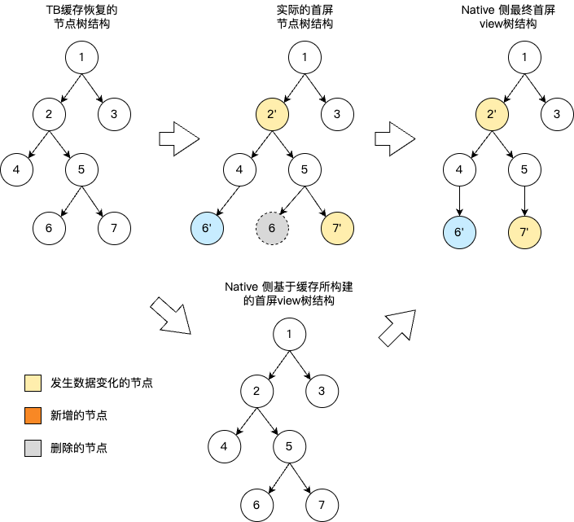
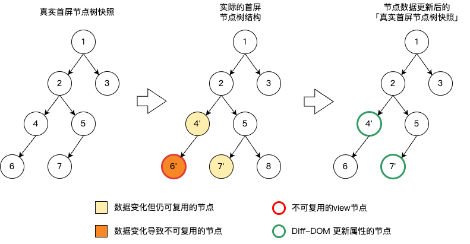
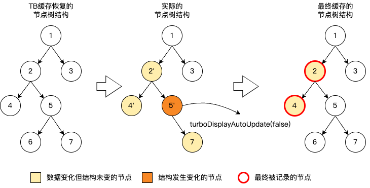

# TurboDisplay 首屏加速机制

## 介绍
TurboDisplay 机制是一套用于加速首屏显示的优化机制，采用自动智能采集机制，业务可以在不做任何修改的情况下对首屏显示进行加速。


## 实现原理

TurboDisplay的核心作用是让绝大多数页面不需要做任何改造即可加速原本页面首屏的展示速度，例如原本的页面是先展示Loading，再展示具体页面内容，那么TurboDisplay加速的是Loading的展示；如果原本的页面是先展示缓存的数据，再展示真实数据，那么TurboDisplay加速的是缓存数据的展示。

而 TurboDisplay 实现智能采集的载体是设计了 **三棵 DOM 树**：

| 树名称 | 说明 | 生命周期 |
|--------|------|----------|
| **缓存树** | 持久化存储在本地文件中，保存页面的完整结构 | 跨越页面重启 |
| **真实树** | 反映当前页面实时渲染状态的节点树 | 随页面创建和销毁 |
| **快照树** | 周期性的真实树快照，实际缓存的目标 | 随页面创建和销毁 |

三棵树的协作过程可以分为两个阶段：**阶段 1** 是基于缓存树构建首屏视图，**阶段 2** 是比对真实树与缓存树、将差异更新至 View 树。

### 阶段 1：缓存树上屏

页面启动加载时，读取 TurboDisplay 的缓存文件，反序列化形成 **缓存树**，并基于缓存树构建初始的 View 树，上屏首屏内容。

### 阶段 2：diff-View —— 比对 DOM 树，更新 View 树

Native 执行 **diff-View**，比对 **缓存树** 与 **真实树**，将结构差异与属性变化更新至 View 树。



diff-View 以 **深度优先遍历** 的方式，逐位置对比缓存树和真实树的节点数据，根据节点是否可复用来决定操作方式：
- **可复用** → 执行 View 节点的属性值更新
- **不可复用** → 删除缓存节点对应的 View 及其子 View 树，再根据真实树节点重建

如图所示，`节点2` 发生数据变化但仍满足可复用条件，执行属性更新；`节点7` 数据更新后判定为不可复用，执行 View 删除并重建；`节点6` 所处结构发生变化，也执行 View 重建。

::: 注意 tip
- diff-view阶段节点树的结构差异，一定会反馈至Native的view树，不会因 view 设置了 turboDisplayAutoUpdateEnable 属性而不执行结构变化的响应。
  :::

两个节点必须 **同时满足以下所有条件** 才会被判定为可复用：

1. **viewName 相同** —— 节点的视图类型必须一致
2. **属性（props）数量相同** —— 属性列表长度必须一致
3. **属性逐项匹配** —— 每个属性的 `propKey` 和 `propType` 必须相同；对于 Attr 类型的属性，若该属性 **不是基础属性**，则还要求 `propValue` 相等
4. **View 方法调用一致** —— 仅比较类型为 View 的方法调用，方法名和参数都必须严格相等

> **基础属性**（Base Attr）指所有 View 通用的属性（如 `backgroundColor`、`opacity`、`frame`、`fontSize`、`color`、`src` 等），这些属性即使值不同也不影响复用判定，后续会通过 diff 流程正常更新。非基础属性（即特定 View 类型独有的属性）值不同时，节点将被判定为不可复用。


阶段 1 与阶段 2 完成后，TurboDisplay 已将真实的业务首屏渲染更新至 Native 的 View 树，等待渲染上屏。

### 持续采集：diff-DOM —— 比对 DOM 树，更新 DOM 树

为了兼顾后续页面逻辑对首屏节点数据的变更，以及确保下次启动时首屏能展示最新的数据，TurboDisplay 会持续采集新的节点数据：周期性地将 **真实树** 与 **快照树** 进行比对（diff-DOM），将变化同步至快照树，并将最新的快照树写入缓存。



diff-DOM 以 **深度优先遍历** 的方式，比对真实树和快照树中 tag 相同的节点，同步其属性的变化。如图所示，`节点4`、`节点6`、`节点7` 发生属性变化为 `节点4'`、`节点6'`、`节点7'`，但 `节点6` 被判定为不可复用，则最终快照树只会发生 `节点4` 和 `节点7` 的属性更新。此外 diff-DOM 默认不响应节点结构的变化，因此真实树的新 `节点8` 并未更新至快照中。

> **diff-View 与 diff-DOM 的核心区别**：
> - **diff-View** 比对的是 **缓存树与真实树**，产出的是 **View 树的渲染操作**（创建、删除、更新 View）
> - **diff-DOM** 比对的是 **真实树与快照树**，产出的是 **DOM 节点数据的同步**（只修改内存中的节点属性，不涉及渲染）

> **提示**：diff-DOM 的节点更新受以下因素控制：
> - View 的 `turboDisplayAutoUpdateEnable` 属性（见下文属性说明）
> - `persistentRealTree` 配置（见下文 TurboDisplayConfig 说明）
> - `autoUpdateTurboDisplay` 配置（见下文 TurboDisplayConfig 说明）


## 使用指引

TurboDisplay 的使用包括 **Kotlin 侧** 所定义的 View 属性控制和 Module 方法，以及 **Native 侧** 的启动开关和能力配置。

### Kotlin 侧

#### 属性

**`turboDisplayAutoUpdateEnable(Boolean)`**

TurboDisplay 会在 diff-DOM 阶段自动更新同结构的节点属性。使用该属性可以控制是否关闭指定节点及其子孙节点的自动更新，默认为 `true`，设置为 `false` 则关闭。



如上图所示，`节点7` 发生属性变化变成 `节点7'`，`节点5` 发生结构变化变成 `节点5'`。原本会被更新到快照树上的 `节点7`，由于 `节点5'` 设置了 `turboDisplayAutoUpdateEnable(false)`，所以 `节点5'` 及其子孙节点 `节点6` 和 `节点7'` 都不会更新到快照树上。而结构一致且未设置该属性的 `节点2`，其本身和子节点都发生了属性变化（变为 `节点2'` 和 `节点4'`），皆被正常记录到了最终缓存的节点树中。

**使用示例：**
```kotlin
View {
    attr {
        turboDisplayAutoUpdateEnable(false)
    }
}
```

#### 方法

`TurboDisplayModule` 提供了管理 TurboDisplay 的相关方法：

| 方法 | 说明 |
|------|------|
| `setCurrentUIAsFirstScreenForNextLaunch(extraContent)` | 手动采集当前视图状态保存到缓存，调用后关闭自动采集 |
| `flushTurboDisplayCache(iCloseUpdate)` | 立即刷新缓存，`iCloseUpdate=true` 时关闭后续更新 |
| `clearCurrentPageCache()` | 清除当前页面缓存 |
| `clearAllCache()` | 清除所有页面缓存 |
| `isTurboDisplay()` | 判断本次打开是否使用了缓存上屏 |

**使用示例：**
```kotlin
acquireModule<TurboDisplayModule>(TurboDisplayModule.MODULE_NAME)
    .setCurrentUIAsFirstScreenForNextLaunch(extraContent)
```


### Native 侧

#### TurboDisplayKey（启动开关）

`TurboDisplayKey` 是 TurboDisplay 的启动开关，必须在 Native 侧配置。若未设置或为空字符串，则关闭 TurboDisplay。

**iOS 配置：**
```objectivec
// KuiklyRenderViewController.m
- (NSString *)turboDisplayKey {
    return pageName;  // 返回 nil 则关闭 TurboDisplay
}
```

**鸿蒙配置：**
```typescript
// Index.ets
KRNativeRender({
    turboDisplayKey: pageName  // 空字符串则关闭 TurboDisplay
})
```

#### TurboDisplayConfig（功能配置）

`TurboDisplayConfig` 用于控制 TurboDisplay 的核心行为，主要参数如下：

- **`diffDOMMode`** —— diff-DOM 的算法模式，决定快照树如何跟踪真实树的变化。
    - `Normal`（默认）：只更新快照树中已有的、结构相同节点的属性值，**不感知节点的增删等结构变化**。适用于首屏结构稳定、仅数据内容变化的场景。
    - `StructureChange`：在属性更新的基础上，额外支持感知节点的 **新增、删除和替换**，确保快照树与真实树的结构保持一致。适用于首屏结构会动态变化的场景（如列表项增减、条件渲染等）。

- **`diffViewMode`** —— diff-View 的执行策略，决定首屏缓存与真实渲染之间的差异如何应用到 View 树。
    - `Normal`（默认）：同步一次性完成事件回放、属性更新和 View 创建/删除。
    - `Delayed`：将 diff-View 拆分为两个阶段——**先回放事件**（保证首屏期间用户的滚动、点击等交互事件被及时响应），**再执行属性更新和 View 操作**（等待跨端侧渲染指令全部到达后执行）。鸿蒙侧由于渲染指令响应时序的特殊性，在执行页面恢复的场景中 **必须开启**。

- **`autoUpdateTurboDisplay`** —— 自动更新开关，默认开启。控制是否在首屏渲染完成后自动、周期性地执行 diff-DOM，将真实树的最新属性同步到快照树并写入缓存。关闭后缓存内容将不再自动刷新，适用于业务希望通过 `setCurrentUIAsFirstScreenForNextLaunch` 手动控制缓存时机的场景。

- **`persistentRealTree`** —— 真实树持久更新开关，默认开启。控制首屏 diff-View 完成后是否继续维护真实树的实时状态。开启时，所有后续的渲染指令都会同步更新真实树，从而为 diff-DOM 和手动刷新缓存提供数据基础。关闭时，真实树将停留在首屏状态，不再跟踪后续变化，可减少性能开销，但将 **丧失 diff-DOM 和强制刷新缓存的能力**。此开关是 `autoUpdateTurboDisplay` 的前置依赖——若关闭，即使 `autoUpdateTurboDisplay` 为 `true`，自动更新也不会执行。

> **配置项之间的依赖关系：**
> ```
> persistentRealTree = true （前提：维护真实树）
>     └── autoUpdateTurboDisplay = true （执行：自动触发 diff-DOM）
>             ├── diffDOMMode 控制 diff-DOM 的算法策略
>             └── diffViewMode 控制 diff-View 的执行策略（独立于 diff-DOM）
> ```

**iOS 配置示例：**
```objectivec
// KuiklyRenderViewController.m
- (KRTurboDisplayConfig *)turboDisplayConfig {
    KRTurboDisplayConfig *config = [[KRTurboDisplayConfig alloc] init];
    [config enableDelayeddiff];
    [config enableStructureAwarediffDOM];
    return config;
}
```

**鸿蒙配置示例：**
```typescript
// Index.ets
KRNativeRender({
    turboDisplayKey: 'PageName_CacheKey',
    turboDisplayConfig: {
        diffViewMode: diffViewMode.DELAYED,
        diffDOMMode: diffDOMMode.STRUCTURE_CHANGE
    }
})
```

